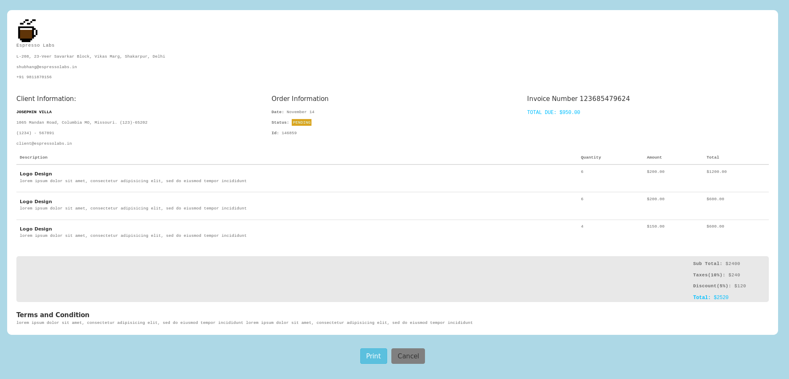
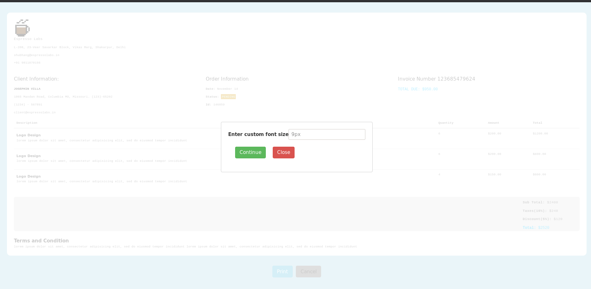
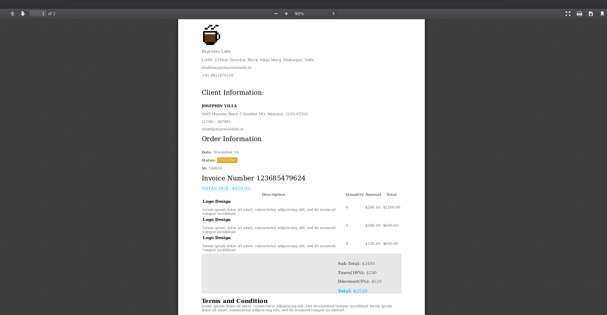

# Invoice Viewer and PDF Generator

[](https://github.com/nightwarriorftw/InvoiceViewer/issues) [](https://github.com/nightwarriorftw/InvoiceViewer/network/members) [](https://github.com/nightwarriorftw/InvoiceViewer/stargazers)    [](https://twitter.com/intent/follow?screen_name=nightwarriorftw) [](https://telegram.me/nightwarriorftw)

## :ledger: Index

- [About](#beginner-about)
- [Usage](#zap-usage)
- [Developmen Environment](#nut_and_bolt-development-environment)
- [Gallery](#camera-gallery)
- [Credit/Acknowledgment](#star2-creditacknowledgment)
- [License](#lock-license)

## :beginner: About
Invoice Viewer and PDF generator

## :zap: Usage
Just run it !!

### :nut_and_bolt: Development Environment

#### 1. Clone the Repository

```Bash
git clone https://github.com/nightwarriorftw/InvoiceViewer.git
cd InvoiceViewer
```

#### 2. Install dependencies
```Bash
yarn install
```

#### 3. Run the project:

```BASH
yarn start
```

## :camera: Gallery
UI of the page


Custom font size modal


Generated Video


## :star2: Ack
**Tech Stack used**
- React and Redux

## :lock: License

[LICENSE](/LICENSE)

*Not hosted ATM because the API provided are HTTP. So calling HTTP APIs from HTTPS results in hosting errors. Have recorder video though*
